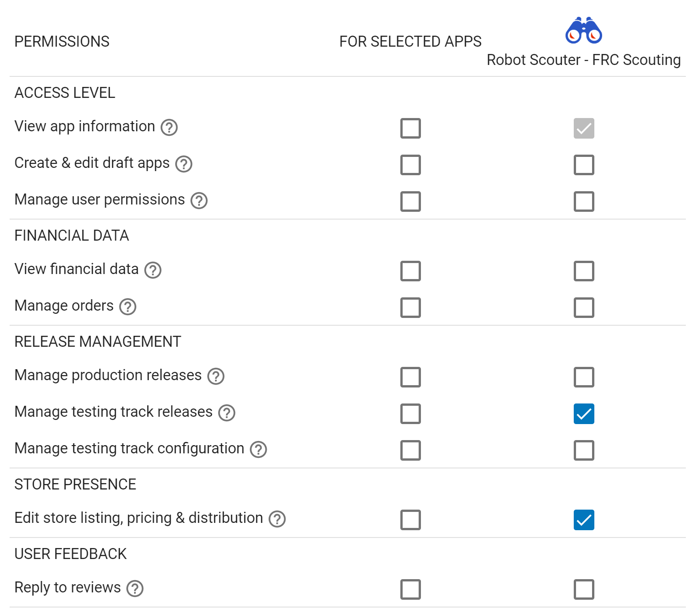

## Google Play Configurations

#### Publishing Your App
Getting your app ready to be published to the play store can sometimes be a tedious and repetitive task.
This document describes how you can leverage the google play developer API to make publishing your app to the play store a much quicker task.

#### Enabling GPP
The Gradle Play Publishers(GPP) plugin is disabled by default, to enable it simply navigate to the `android-template-v2/play-config.properties` file and
do the following

```properties
# Set this value to true
ENABLED=true
```
Once enabled you have access to publishing your app based on the settings provided. Be sure to have your google play console set up for accepting your app below describes how to do so:

## Prerequisites

### Initial Play Store upload

The first APK or App Bundle needs to be uploaded via the Google Play Console because registering the
app with the Play Store cannot be done using the Play Developer API. For all subsequent uploads and
changes, GPP may be used.

### Signing configuration

To successfully upload apps to the Play Store, they must be signed with your developer key. Make
sure you have
[a valid signing configuration](https://developer.android.com/studio/publish/app-signing#gradle-sign).

### Service Account

To use GPP, you must create a service account with access to the Play Developer API:

1. If you don't already have one, create a GCP project for your app(s)
1. Enable the
[AndroidPublisher API](https://console.cloud.google.com/apis/library/androidpublisher.googleapis.com)
for that GCP project
1. [Link your Google Play developer account](https://play.google.com/apps/publish#ApiAccessPlace)
to your GCP project
1. Create a
[service account and key](https://console.cloud.google.com/apis/credentials/serviceaccountkey)
1. Make sure you're in the GCP project you used above (check the `project` query param in the
	URL)
1. Select `New service account`
1. Give it a name and the Project Owner role (don't worry, we'll remove this later)
1. Leave JSON checked
1. Move the downloaded JSON credentials into your project and update the `CREDENTIALS_JSON` variable  in the `play-config.properties` file with the path to your credentials file relative to your project directory
1. Give your service account
[permissions to publish apps](https://play.google.com/apps/publish#AdminPlace) on your behalf
1. Click `Invite new user`
1. Copypaste the service account email (you can find it in the JSON credentials)
1. Don't touch the roles
1. Specify which apps the service account should have access to. In this example, GPP has full
	access to testing tracks and app listings, but will be unable to make production releases:
	
1. Now that you've successfully created the connection between GCP and Google Play, you can remove
the Project Owner permissions
1. Go to your [IAM settings](https://console.cloud.google.com/iam-admin/iam)
1. Search for the service account you created
1. Click the edit icon (found at the end of the row)
1. In the permission selection panel that opens, click the trash icon to remove the owner role
1. Click save

⚠️ Please note that once your initial setup is done that you will have to publish your app to the desired track that you want manually at least once before using this feature as described in [the initial upload](#initial-play-store-upload) section.

## Using GPP
Once the initial setup is done now your ready to start using the plugin. Simply navigate to the terminal and type `gradlew publish` to send your app to the play store or `gradlew publishBundle` to send an app bundle to the play store.

Alternatively you can specify in the `play-config.properties` file whether or not you want to publish your app as an app bundle using the  `USE_APP_BUNDLES` variable and it will automatically publish it with that setting.

And that's it! 🎉 If you are in need of any other additional settings you can head over to the `app/build.gradle.kts` file and look for the `playConfigs {} ` block to add and or modify any settings to fit your needs.
